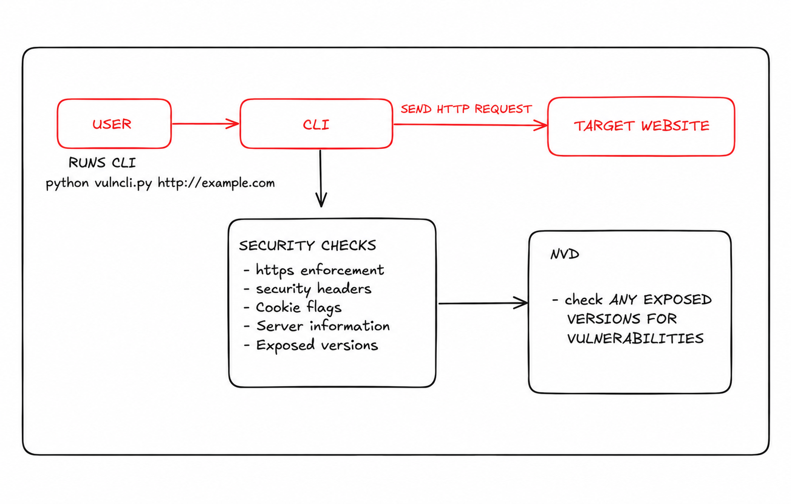
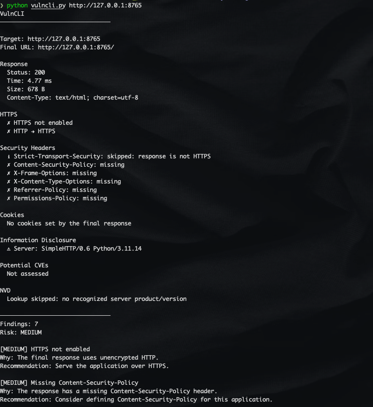
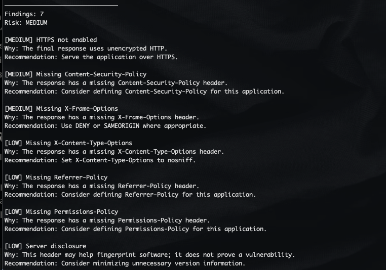
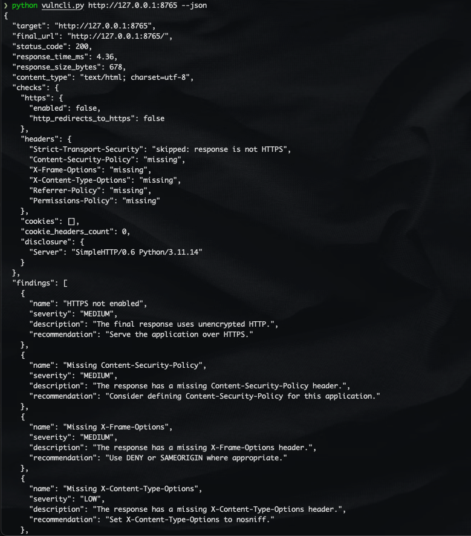
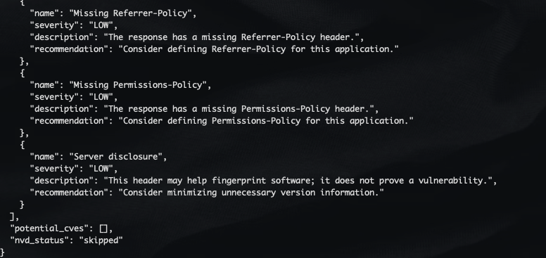

# VulnCLI

A command-line web security scanner that checks a website's HTTP response for common security misconfigurations and looks up exposed server versions against the NVD.

## High level overview



## Why I built it

When checking a website for basic security issues, it is useful to quickly see whether common protections are configured correctly. Inspecting headers and cookie settings manually gets repetitive, so I built VulnCLI to bring these checks into one terminal report, with an explanation and a suggested fix for each finding.

## How it works

VulnCLI takes a website URL, follows redirects, and inspects the final HTTP response. It checks HTTPS, security headers, cookie attributes, and software information exposed by the server. If a supported server version is visible, it searches the National Vulnerability Database (NVD) for potential CVE matches.

1. **HTTPS:** Checks whether the final URL uses HTTPS and whether an HTTP starting URL redirects to HTTPS.
2. **Security headers:** Checks for missing headers and basic value errors in HSTS, CSP, X-Frame-Options, X-Content-Type-Options, Referrer-Policy, and Permissions-Policy.
3. **Cookies:** Checks each parsed cookie for `Secure`, `HttpOnly`, and a valid `SameSite` setting.
4. **Information disclosure:** Identifies software details exposed through `Server` and `X-Powered-By` headers.
5. **Potential CVEs:** Searches NVD for potential matches when the `Server` header exposes an Apache, nginx, or Microsoft-IIS version.

VulnCLI checks the response reached after redirects. It checks HSTS on HTTPS responses and CSP and X-Frame-Options on HTML responses. Header checks cover basic configuration, and cookie values stay out of the report.

## Demo scan

Local HTTP server used for this example:

```sh
python -m http.server 8765 --bind 127.0.0.1
```

Run command:

```sh
python vulncli.py http://127.0.0.1:8765
```



The report shows response details and flags unencrypted HTTP, missing security headers, and server disclosure, with an overall **MEDIUM** risk. NVD lookup is skipped because SimpleHTTP is not a supported server product.

### Example finding



Each finding shows the issue, its severity, why it matters, and a suggested fix. For example, a missing Content-Security-Policy header is marked **MEDIUM**, with a recommendation to define a policy for the application.

Overall risk reflects the most severe finding. If no issues are found, it shows **NONE**.

### JSON output

Use `--json` to get the same report in a format that can be saved or processed by another tool:

```sh
python vulncli.py http://127.0.0.1:8765 --json
```



The report continues with the remaining findings and the NVD lookup status:



The JSON output includes the target URL, response details, check results, findings, and potential CVE matches. `nvd_status` shows whether the lookup completed, was skipped, or was unavailable. CVE matches are based on the exposed server version and do not confirm a vulnerability.

### Run the tests

```sh
python -m pytest -q
```

## Running locally

Use Python 3.9 or newer. From the project directory, install the dependencies and run VulnCLI with your website's URL:

```sh
python3 -m venv .venv
source .venv/bin/activate
python -m pip install -r requirements.txt
python vulncli.py https://example.com
```

Replace `https://example.com` with your website's URL. Add `--json` for JSON output.

**Note:** An NVD API key is optional; set it with `export NVD_API_KEY="your-key"` before running VulnCLI.
